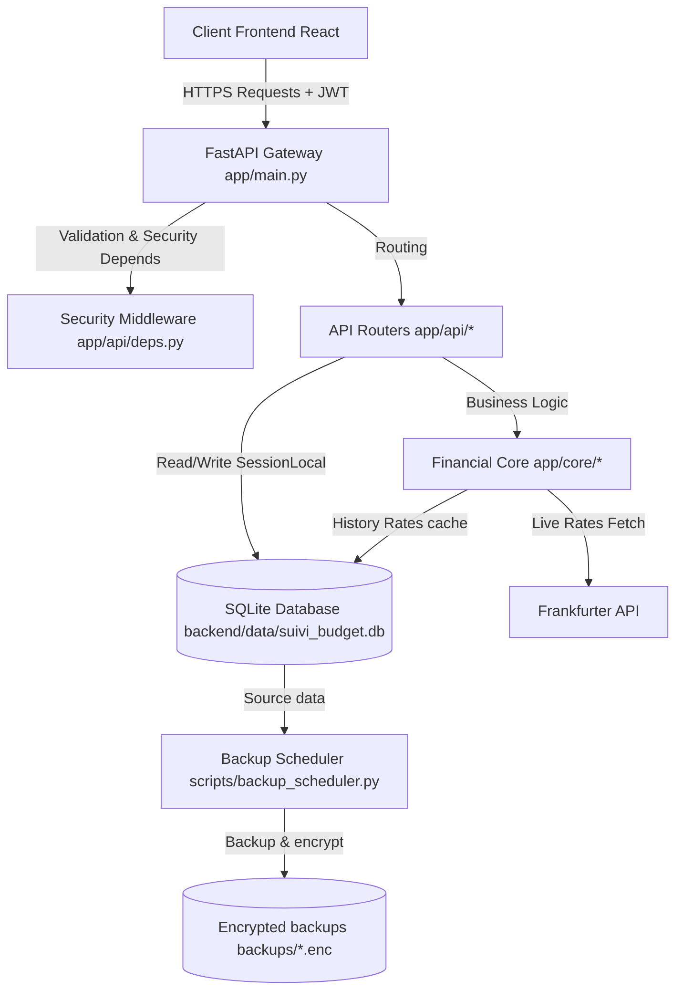

# Documentation Complète du Backend Numera

Ce document fournit une vue d'ensemble technique, opérationnelle et architecturale du backend de l'application **Numera**. Il est destiné aux développeurs et aux administrateurs système pour comprendre comment le système fonctionne, comment le monitorer et comment le déployer.

---

## 1. Stack Technique & Choix Architecturaux

Le backend de Numera est conçu selon le principe **Local-First & Privacy**. Il s'exécute localement et stocke les données sans faire appel à des services cloud tiers (à l'exception des taux de change).

### La Stack Technique

| Technologie | Composant / Rôle | Version / Détails |
| :--- | :--- | :--- |
| **Langage** | [Python](https://www.python.org/) | Python 3.10+ |
| **Framework Web** | [FastAPI](https://fastapi.tiangolo.com/) | `0.116.1` (ASGI, asynchrone) |
| **Serveur ASGI** | [Uvicorn](https://www.uvicorn.org/) | `0.35.0` (standard) |
| **Base de Données** | [SQLite](https://sqlite.org/) | Fichier local `suivi_budget.db` |
| **ORM** | [SQLAlchemy](https://www.sqlalchemy.org/) | `2.0.43` (syntaxe moderne 2.0 `Mapped`) |
| **Migrations** | [Alembic](https://alembic.sqlalchemy.org/) | `1.16.5` |
| **Validation & Schémas** | [Pydantic](https://docs.pydantic.dev/) | `v2.11.7` & `pydantic-settings` |
| **Sécurité** | [python-jose](https://github.com/mpdavis/python-jose) & [bcrypt](https://github.com/pyca/bcrypt) | JWT token HS256 / Hashage de mot de passe |
| **Tests** | [Pytest](https://docs.pytest.org/) | `8.3.3` |

### Pourquoi cette Stack ?

1. **FastAPI & Pydantic v2** : Offrent des performances exceptionnelles (grâce au cœur de validation de Pydantic v2 écrit en Rust) et un typage fort. La génération automatique de la documentation interactive Swagger UI (`/docs`) et ReDoc (`/redoc`) facilite grandement l'intégration avec le frontend.
2. **SQLite** : Parfaitement adapté au modèle **mono-utilisateur** (Single Admin). SQLite élimine le besoin d'installer, configurer et administrer un serveur de base de données complet comme PostgreSQL ou MySQL. Cela garantit une empreinte système minimale et un respect total de la vie privée (les données restent sur la machine de l'utilisateur).
3. **SQLAlchemy 2.0 & Alembic** : Permettent de modéliser proprement les relations complexes (par exemple, le chaînage des virements internes, les liaisons de transactions récurrentes) tout en conservant une flexibilité totale de migration de schéma lors des mises à jour applicatives.
4. **Authentification JWT simple** : Conforme au modèle de déploiement privé, l'application utilise un unique compte d'administration avec une validité de jeton d'une heure.

---

## 2. Architecture & Fonctionnement Interne

### Arborescence du Code Backend

```text
backend/
├── alembic/                # Scripts de migrations de schéma de base de données
├── app/                    # Code source principal de l'application
│   ├── api/                # Routeurs et endpoints FastAPI
│   ├── core/               # Logique métier, configuration, sécurité, devises
│   ├── db/                 # Connexion et session SQLAlchemy
│   ├── models/             # Modèles de l'ORM SQLAlchemy
│   └── schemas/            # Schémas de validation Pydantic (v2)
│   └── main.py             # Point d'entrée de l'application FastAPI
├── data/                   # Répertoire contenant le fichier SQLite (exclu de Git)
├── scripts/                # Scripts utilitaires (backups, seeds, migrations)
├── tests/                  # Tests unitaires et d'intégration avec Pytest
├── Dockerfile              # Dockerfile pour le conteneur backend
├── requirements.txt        # Dépendances Python requises
└── alembic.ini             # Configuration d'Alembic
```

### Diagramme des Flux Applicatifs



### Cycle de vie & Tâches d'arrière-plan

Au démarrage de l'application (événement `lifespan` configuré dans [backend/app/main.py](file:///Users/hugogalley/DEV/numera/backend/app/main.py)) :
1. **Migrations automatiques** : Si `APP_ENV` n'est pas configuré sur `test`, Alembic est exécuté automatiquement via `run_migrations()` dans [backend/app/core/migrations.py](file:///Users/hugogalley/DEV/numera/backend/app/core/migrations.py) pour mettre à jour la structure de la base de données.
2. **Peuplement par défaut (Seeding)** : Les catégories de dépenses/revenus fondamentales sont insérées si elles sont absentes via `seed_default_categories()` dans [backend/app/core/seeds.py](file:///Users/hugogalley/DEV/numera/backend/app/core/seeds.py).
3. **Tâche récurrente asynchrone** : Une boucle asynchrone permanente (`recurring_transactions_task`) est lancée en tâche de fond. Elle s'exécute toutes les heures pour :
   - Générer automatiquement les instances de transactions récurrentes (abonnements, charges fixes) définies par l'utilisateur ([backend/app/core/recurring.py](file:///Users/hugogalley/DEV/numera/backend/app/core/recurring.py)).
   - Vérifier et générer les transactions liées aux salaires configurés et jours de télétravail déclarés ([backend/app/core/salary.py](file:///Users/hugogalley/DEV/numera/backend/app/core/salary.py)).

### Règles Métier Majeures

- **Calcul du Solde Cumulé (Running Balance)** : Contrairement à d'autres architectures, le solde cumulé à un instant T (`running_balance`) est stocké directement sur chaque transaction financière. Lors de l'ajout, modification ou suppression d'une transaction, le backend recalcule récursivement et chronologiquement les soldes cumulés du compte concerné via `recalculate_running_balances` ([backend/app/core/finance.py](file:///Users/hugogalley/DEV/numera/backend/app/core/finance.py)) afin de garantir l'intégrité absolue des graphiques temporels.
- **Gestion Multidevises** :
  - L'application supporte nativement les transactions en devises étrangères (USD, GBP, CHF, etc.).
  - Le taux de change de référence est l'**EUR**. Les conversions s'effectuent via l'API publique Frankfurter.
  - Les taux courants sont mis en cache mémoire pendant 6 heures. Les taux historiques sont mis en cache de manière prévisible dans la table SQL `historical_exchange_rates`.
  - En cas d'indisponibilité réseau, le système bascule sur des taux de secours (fallback offline) codés en dur dans [backend/app/core/currency.py](file:///Users/hugogalley/DEV/numera/backend/app/core/currency.py).
- **Auto-catégorisation & Normalisation** :
  - Le moteur de catégorisation automatique applique des motifs textuels basés sur les marchands via la table `categorization_rules`.
  - Les alias de commerçants sont normalisés à l'aide des tables `merchants` et `merchant_aliases` afin de nettoyer les libellés bancaires bruts (par exemple, mapper `INTERMARCHE PARIS 15` et `INTERMARCHE LYON` vers le marchand canonique `Intermarché`).

---

## 3. Sécurité & Authentification

L'application implémente un système d'authentification simple mais robuste :
- **Authentification Unique** : Un compte administrateur unique est géré par les variables d'environnement `ADMIN_USERNAME` (par défaut `admin`) et `ADMIN_PASSWORD_HASH`.
- **Génération de mot de passe** : Pour générer ou modifier le mot de passe, un script utilitaire est fourni. Vous devez hacher le mot de passe avant de l'ajouter dans votre fichier `.env` :
  ```bash
  python3 backend/scripts/change_password.py "votre_mot_de_passe"
  ```
- **JWT (JSON Web Tokens)** : Lors de la connexion (`POST /auth/token`), un token JWT signé en `HS256` avec la clé `SECRET_KEY` est généré. Sa validité est fixée à **60 minutes** (configurable via `ACCESS_TOKEN_EXPIRE_MINUTES` dans [backend/app/core/config.py](file:///Users/hugogalley/DEV/numera/backend/app/core/config.py)).
- **Dépendance de Sécurité** : Toutes les routes nécessitant une authentification incluent la dépendance `Depends(get_current_user)` qui valide le jeton et lève une exception `HTTP 401 Unauthorized` si le token a expiré ou est invalide.

---

## 4. Monitoring & Journalisation

### Journalisation (Logging)

L'application utilise le module de journalisation natif de Python configuré dans [backend/app/core/logging.py](file:///Users/hugogalley/DEV/numera/backend/app/core/logging.py).

> [!NOTE]
> En mode développement (`APP_ENV=dev`), le niveau de log par défaut est `DEBUG`. En production (`APP_ENV=prod`), il est limité à `INFO`.

Les logs sont envoyés sur la sortie standard `sys.stdout`. En environnement conteneurisé, ces logs sont capturés par Docker et peuvent être consultés avec :
```bash
docker logs -f numera-backend-prod
```

#### Middleware de log automatique
Un middleware HTTP personnalisé intercepte toutes les requêtes :
- **Suivi des requêtes** : Chaque requête reçoit une ligne de log récapitulative contenant la méthode HTTP, le chemin de la ressource, le code de statut HTTP et le temps de traitement en millisecondes.
  ```text
  2026-06-24 18:00:00,000 - app.main - INFO - method=GET path=/accounts status=200 duration=12.45ms
  ```
- **Gestion des exceptions** : Toutes les erreurs non gérées au niveau des endpoints sont attrapées par le middleware, journalisées au niveau `ERROR` avec la trace d'exécution complète (traceback) avant d'être renvoyées sous forme d'erreur HTTP 500 pour préserver la stabilité de l'application.
- **Filtrage de bruit** : Les appels de surveillance de santé réussis (`GET /health` retournant un statut `200`) sont exclus des logs pour éviter de polluer les fichiers de journalisation.

### Surveillance de l'état (Healthcheck)

Le conteneur de production intègre une directive de surveillance `healthcheck` :
```yaml
healthcheck:
  test: ["CMD", "curl", "-f", "http://localhost:8001/health"]
  interval: 10s
  timeout: 5s
  retries: 5
  start_period: 20s
```
L'endpoint `/health` vérifie simplement que l'application répond correctement. Si 5 vérifications consécutives échouent, Docker marque le conteneur comme `unhealthy` et le redémarre automatiquement si `restart: always` est configuré.

---

## 5. Procédures de Déploiement

Le déploiement est entièrement orchestré via **Docker** et **Docker Compose** pour une installation et des mises à jour en un clic.

### Configuration Initiale

Avant de lancer le serveur de production, exécutez le script d'initialisation :
```bash
make setup
# ou
./setup.sh
```
Ce script effectue les tâches suivantes :
1. Crée un fichier de configuration `.env` à partir de `.env.example` si celui-ci n'existe pas.
2. Génère de manière sécurisée une clé aléatoire pour `SECRET_KEY`.
3. Génère une clé de chiffrement symétrique Fernet (`BACKUP_KEY`) nécessaire aux sauvegardes de bases de données.
4. Crée les dossiers locaux `backend/data/` (base de données active) et `backups/` (sauvegardes chiffrées).

### Exécution du Serveur

Le projet propose deux configurations d'exécution gérées par le [Makefile](file:///Users/hugogalley/DEV/numera/Makefile) :

#### Mode Développement
Démarre l'application en mode local interactif avec rechargement à chaud (hot reload) lors de modifications du code :
```bash
make dev
```
*Le backend écoute sur le port `8001` et le frontend sur le port `5173`.*

#### Mode Production
Construit et démarre les images Docker optimisées en arrière-plan (mode détaché) avec redémarrage automatique en cas de panne :
```bash
make prod
```
*Le frontend de production écoute sur le port `8082` et communique avec le backend sur le port `8001`.*

Pour arrêter la production :
```bash
make prod-down
```

---

## 6. Sauvegardes & Restauration

### Le Service de Sauvegarde (Backup)

Dans la configuration de production ([docker-compose.prod.yml](file:///Users/hugogalley/DEV/numera/docker-compose.prod.yml)), un service nommé `backup` s'exécute de manière isolée. Il lance le planificateur de sauvegarde [backend/scripts/backup_scheduler.py](file:///Users/hugogalley/DEV/numera/backend/scripts/backup_scheduler.py).

- **Intervalle** : Par défaut, le script effectue une sauvegarde toutes les 24 heures (configurable via la variable `BACKUP_INTERVAL_SECONDS`).
- **Chiffrement** : Si `BACKUP_KEY` est défini dans le fichier `.env`, le fichier SQLite est chiffré en utilisant l'algorithme symétrique Fernet (AES-128 en mode CBC avec signature HMAC) avant d'être écrit sur le disque. Le fichier de sauvegarde prend alors l'extension `.db.enc`.
- **Rétention** : Le script purge automatiquement les sauvegardes de plus de 7 jours (configurable via `RETENTION_DAYS`, par défaut 7 jours).

### Commandes Utiles de Sauvegarde

#### Déclencher une sauvegarde immédiate
Vous pouvez forcer une sauvegarde à tout moment sans attendre le planificateur via la commande :
```bash
make backup-now
```
Cette commande exécute le script [backend/scripts/backup.py](file:///Users/hugogalley/DEV/numera/backend/scripts/backup.py) au sein du conteneur en cours d'exécution.

#### Restaurer une sauvegarde
Pour restaurer la base de données à partir d'un fichier de sauvegarde chiffré, utilisez la commande suivante :
```bash
make backup-restore FILE=backups/suivi_budget_YYYYMMDD_HHMMSS.db.enc
```
Le script de restauration [backend/scripts/restore.py](file:///Users/hugogalley/DEV/numera/backend/scripts/restore.py) effectue les étapes de sécurité suivantes :
1. Il recherche la clé `BACKUP_KEY` pour déchiffrer le fichier.
2. Il tente d'ouvrir une connexion de test SQLite sur la base déchiffrée pour valider son intégrité.
3. Si la base est valide, il remplace de manière atomique la base de données active `backend/data/suivi_budget.db`.

> [!CAUTION]
> Conservez impérativement la clé `BACKUP_KEY` présente dans votre fichier `.env`. Sans cette clé, les sauvegardes chiffrées existantes ne pourront plus jamais être déchiffrées ou restaurées.

---

## 7. Tests & Validation

La validation de la qualité et de la régularité du code backend s'effectue via des tests automatisés :
- Les tests unitaires et d'intégration sont exécutés en utilisant **Pytest**.
- La configuration de test utilise une base de données SQLite en mémoire ou un fichier de base temporaire jetable (configuré dans les fixtures Pytest).
- Pour exécuter les tests localement :
  ```bash
  make test
  ```
- Pour valider la conformité complète (tests backend et build frontend réussi) avant de pousser sur la production :
  ```bash
  make validate
  ```
